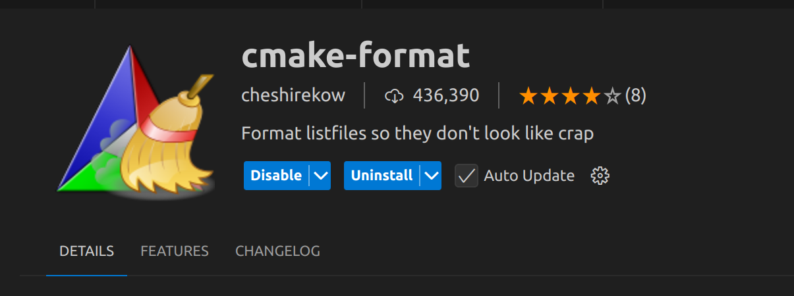
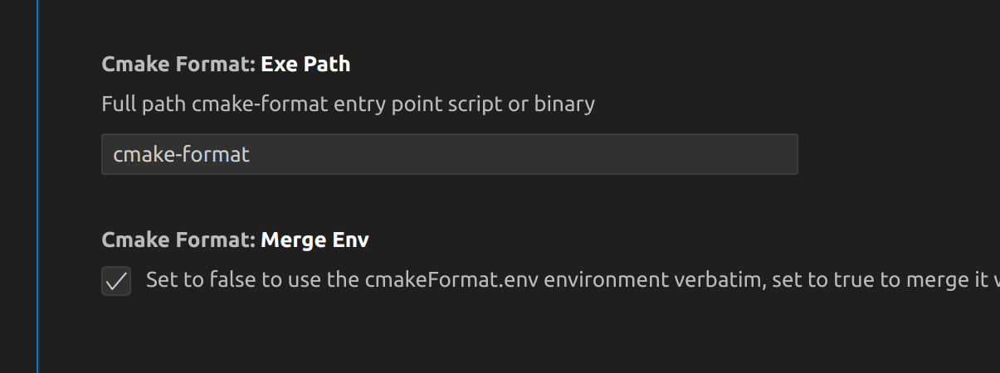

## 使用 cmake-format 工具

#### 安装运行

安装

```bash
pip install cmake-format
```

运行格式化

```bash
cmake-format -i CMakeLists.txt
```


#### VSCode中安装对应的 cmake-format 插件



安装后检查或设置一下 `cmake-foramt` 的路径




#### 使用自定义配置文件

`cmake-format` 支持自定义配置文件，支持`.cmake-format.py`和`.cmake-format.yaml`。

配置文件放在项目根目录，`cmake-format` 会自动加载。如果放在别的地方，也可以通过命令行参数 `-c <config_file>` 指定配置文件，或在插件设置中填写。


#### 配置文件示例

```python
# -----------------------------
# Options effecting formatting.
# -----------------------------
with section("format"):

  line_width = 80

  tab_size = 2

  separate_ctrl_name_with_space = False

  separate_fn_name_with_space = False

  dangle_parens = True

  align_args = True

  space_before_paren = True

  separate_args = True

  split_before_named_args = False
```