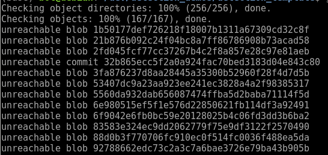
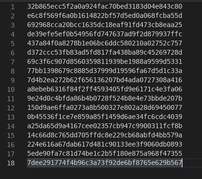

## 恢复git stash误删的内容

不小心使用 `git drop stash` 误删了暂存的内容 (或是 `git stash pop` 后丢失)，怎么恢复？

其实drop后并没有真正删除暂存的内容，而是移除了对它的引用，所以通过一些操作是可以找回的。


### 模拟误删场景

- `git st` 查看当前修改

    ```bash
    On branch master
    Your branch is up-to-date with 'origin/master'.
    Changes not staged for commit:
      (use "git add/rm <file>..." to update what will be committed)
      (use "git checkout -- <file>..." to discard changes in working directory)

        deleted:    calibration/adjust_result.json
        modified:   calibration/config.json
        modified:   calibration/src/rd_test.cc
        modified:   pose_estimation/CMakeLists.txt
        modified:   test/CMakeLists.txt
        modified:   test/multiple_sensors.json
        modified:   test/src/test_multiple_sensors.cc
    ```

- `git stash` 暂存修改

  ```bash
  Saved working directory and index state WIP on master: 4d74f8a fix spell
  HEAD is now at 4d74f8a fix spell
  ```

- `git stash list` 查看暂存内容列表

  ```bash
  stash@{0}: WIP on master: 4d74f8a fix spell
  ```

- `git stash drop stash@{0}` 移除暂存内容

  ```bash
  Dropped refs/stash@{0} (0b45536f1ce7e859a85f1459d6ae34fc6cdc4039)
  ```

至此已经把暂存的修改内容移除了


### 恢复步骤

#### 1. 查找unreachable的记录

```bash
git fsck --unreachable
# git fsck --lost-found
```




可能会查找到几百条记录，截图了部分。这些记录有三种类型：blob、tree和commit。

> blob：每个blob代表一个版本的文件，blob只包含文件的数据，而忽略文件的其他元数据，如名字、路径、格式等。tags tag用于给某个上述类型的对象指配一个便于开发者记忆的名字, 通常用于某次commit。

> tree：每个tree代表了一个目录的信息，包含了此目录下的blobs，子目录，文件名、路径等元数据。因此，对于有子目录的目录，git相当于存储了嵌套的trees。

> commit：每个commit记录了提交一个更新的所有元数据，如指向的tree，父commit，作者、提交者、提交日期、提交日志等。每次提交都指向一个tree对象，记录了当次提交时的目录信息。一个commit可以有多个父commits。


一般来说能用得上的是commit后跟的id，所以可以用 `grep` 过滤一下

```bash
git fsck --unreachable | grep commit
```

```
Checking object directories: 100% (256/256), done.
Checking objects: 100% (167/167), done.
unreachable commit 32b865ecc5f2a0a924fac70bed3183d04e843c80
unreachable commit e6c8f569f6a0b1614822bf57d5ed0a068fcba55d
unreachable commit 692968cca20bcc1635dc18eaf91fd473cb8eaa25
unreachable commit de39efe5ef0b54956fd747637ad9f2d879937ffc
unreachable commit 437a84f0a8278b1e06bc6ddc580210a02752c757
unreachable commit d372ccc53fb83ad5fd817fa438ba89c45269728d
unreachable commit 69c3f6c907d8560359811939be1988a9599d5331
unreachable commit 77bb1398679c8885d37999d19596fa67d5d1c33a
unreachable commit 7d4b2ea272b62f656136207bd4ada0727308a416
unreachable commit a8ebeb6316f84f2ff4593405fd9e6171c4e3fa06
unreachable commit 9e24d0c4bfda86b4b0728f524b8e4e73bbde207b
unreachable commit 150d9ae6ffa0273a8b500327e802a28d69450077
unreachable commit 0b45536f1ce7e859a85f1459d6ae34fc6cdc4039
unreachable commit a25da65d9a4167cee02357cb947c9900311fcf8b
unreachable commit 14c66d8c765dd705ffdc8e229cb68abfd4bb579a
unreachable commit 224e616a67dab617d481c90133ee3f9060db0893
unreachable commit 5ede90fa7c81d74be1c2b5f180e875a968f47355
unreachable commit 7dee291774f4b96c3a73f92de6bf8765e629b567
```


#### 2. 查看修改内容

- 查看完整修改内容

	```bash
    git show 32b865ecc5f2a0a924fac70bed3183d04e843c80
	```

	```bash
    commit 32b865ecc5f2a0a924fac70bed3183d04e843c80
    Author: Tiffany Zhou <xueying.zhou@dorabot.com>
    Date:   Wed Nov 3 17:33:13 2021 +0800

        index on feature/depalletizing: aa9d706 update for dr_vision_lib

    diff --git a/include/pcl_utils/tree.hh b/include/pcl_utils/tree.hh
    index 11e46c1..ceb56be 100644
    --- a/include/pcl_utils/tree.hh
    +++ b/include/pcl_utils/tree.hh
    @@ -11,7 +11,7 @@ template <typename PointT>
	```

- 查看修改文件
	```bash
    git show 32b865ecc5f2a0a924fac70bed3183d04e843c80 --stat
	```

	``` bash
    Author: Tiffany Zhou <xueying.zhou@dorabot.com>
    Date:   Wed Nov 3 17:33:13 2021 +0800
    
    index on feature/depalletizing: aa9d706 update for dr_vision_lib
    
    include/pcl_utils/tree.hh | 2 +-
    1 file changed, 1 insertion(+), 1 deletion(-)
	```


#### 3. 找到误删的内容

那么很清晰了，查看每个unreachable commit的修改内容就能找到误删的stash。但是用得越久的repo，找出来的记录就越多，而且记录并不是按照时间来排序的，手动查看每个修改内容也太费时了。

我的方法是把所有记录复制到编辑器，将 “unreachable commit” 删除，只留下所有的id，存成文件，然后用简单脚本读取循环。



```bash
#!/bin/bash

cat unreachable.txt | while read line
do
    git show $line
    echo "------------------"
done
```


如果能大概记得修改了哪些文件，可以用 `--stat | grep` ，比如这份暂存内容修改了 `test/src/test_multiple_sensors.cc`

```bash
#!/bin/bash

cat unreachable.txt | while read line
do
    echo $line
    # 也可以打印出时间来方便筛查
    # git show $line | grep Date 
    git show $line | grep test/src/test_multiple_sensors.cc
    echo "------------------"
done

```

运行时也可以输出到文件里，更方便查找：
```bash
sh xxx.sh > xxx.log
```

```bash
437a84f0a8278b1e06bc6ddc580210a02752c757
------------------
150d9ae6ffa0273a8b500327e802a28d69450077
------------------
0b45536f1ce7e859a85f1459d6ae34fc6cdc4039
diff --cc test/src/test_multiple_sensors.cc
--- a/test/src/test_multiple_sensors.cc
+++ b/test/src/test_multiple_sensors.cc
------------------
```

如果查到多个结果，可以再使用 `git show ${commit_id} ` 确认。


#### 4. 恢复找到的记录

```bash
git stash apply ${commit_id}
# git stach apply 0b45536f1ce7e859a85f1459d6ae34fc6cdc4039

# 如果遇到报错: 
# fatal: '${commit_id}' is not a stash-like commit
# 可尝试: 
# 1. git cherry-pick ${commit_id}
# 2. git git checkout -b temp-branch ${commit_id}
```

