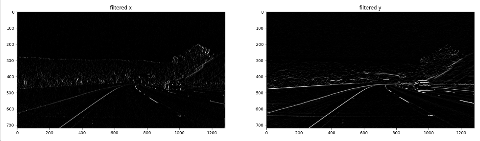
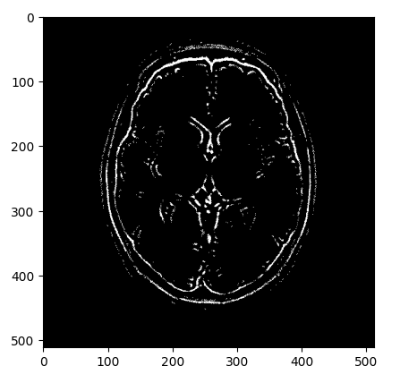

## 高通滤波: 通常使用来检测边缘

#### sobel算子


#### Scharr算子 (更敏感/细致)


#### Laplacian(拉普拉斯)算子 (对噪声较敏感，一般搭配其他操作)


```python
import matplotlib.pyplot as plt
import matplotlib.image as mpimg

import cv2
import numpy as np

%matplotlib inline

# Read in the image
image = cv2.imread('images/curved_lane.jpg')
image = cv2.cvtColor(image, cv2.COLOR_BGR2RGB)

gray = cv2.cvtColor(image, cv2.COLOR_RGB2GRAY)

f, (p1, p2) = plt.subplots(1, 2, figsize=(20,10))
p1.set_title('original img')
p1.imshow(image)

p2.set_title('gray img')
p2.imshow(gray, cmap='gray')
```


```python
# Create a custom kernel
# 3x3 array for edge detection

sobel_x= np.array([[-1, 0, 1],
                   [-2, 0, 2],
                   [-1, 0, 1]])

sobel_y= np.array([[-1,-2,-1],
                   [0, 0, 0],
                   [1, 2, 1]])

# laplacian, edge filter
laplacian=np.array([[0, 1, 0],
                    [1,-4, 1],
                    [0, 1, 0]])
```

```python
# Filter the image using filter2D, which has inputs: (grayscale image, bit-depth, kernel)  
filtered_x_image = cv2.filter2D(gray, -1, sobel_x)

filtered_y_image = cv2.filter2D(gray, -1, sobel_y)

f, (p1, p2) = plt.subplots(1, 2, figsize=(20,10))
p1.set_title('filtered x')
p1.imshow(filtered_x_image, cmap='gray')

p2.set_title('filtered y')
p2.imshow(filtered_y_image, cmap='gray')
```




## 低通滤波: 通常使用来去噪


#### 均值滤波


#### 高斯滤波 (权重与距离相关)


#### 中值滤波


```python
# Read in the image
image = cv2.imread('images/brain_MR.jpg')

# Convert to grayscale for filtering
gray = cv2.cvtColor(image, cv2.COLOR_BGR2GRAY)

# Create a Gaussian blurred image
gray_blur = cv2.GaussianBlur(gray, (9, 9), 0)

# use custom kernal
# gaussian = (1/16)*np.array([[1, 2, 1],
#                            [2, 4, 2],
#                            [1, 2, 1]])
# 
# gray_blur = cv2.filter2D(gray, -1, gaussian)

f, (ax1, ax2) = plt.subplots(1, 2, figsize=(20,10))
ax1.set_title('original gray'),ax1.imshow(gray, cmap='gray')
ax2.set_title('blurred image'),ax2.imshow(gray_blur, cmap='gray')
```


```python
# Filter the orginal and blurred grayscale images using filter2D
filtered = cv2.filter2D(gray, -1, sobel_y)
filtered_blurred = cv2.filter2D(gray_blur, -1, sobel_y)

f, (ax1, ax2) = plt.subplots(1, 2, figsize=(20,10))
ax1.set_title('original & filtered imnage'),ax1.imshow(filtered, cmap='gray')
ax2.set_title('blurred & filtered image'),ax2.imshow(filtered_blurred, cmap='gray')
```


```python
retval, binary_image = cv2.threshold(filtered_blurred, 50, 255, cv2.THRESH_BINARY)
plt.imshow(binary_image, cmap='gray')
```


```python
filtered_blurred = cv2.filter2D(gray_blur, -1, laplacian)
retval, binary_image = cv2.threshold(filtered_blurred, 5, 255, cv2.THRESH_BINARY)
plt.imshow(binary_image, cmap='gray')
```

