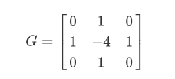
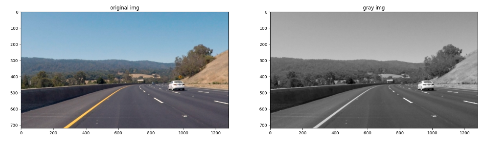
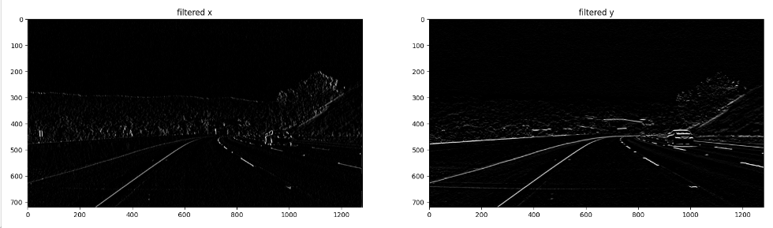
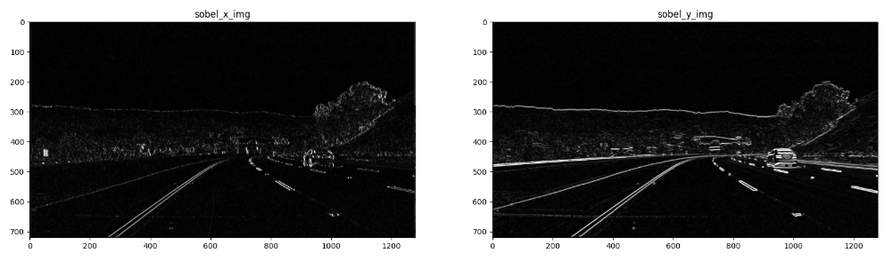
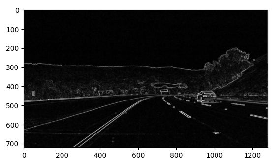
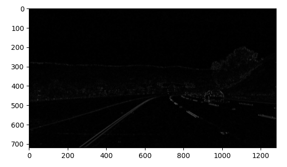
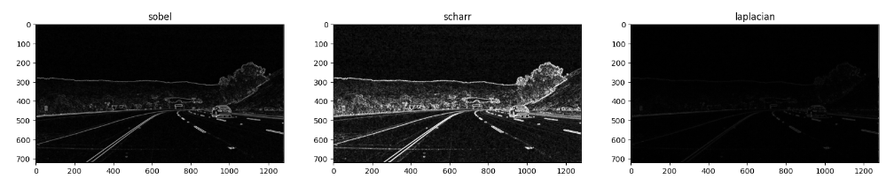

## 高通滤波: 通常使用来检测边缘


### 常见算子

##### sobel算子


##### Scharr算子 (更敏感/细致)


##### Laplacian(拉普拉斯)算子 (对噪声较敏感，一般搭配其他操作)




### 具体代码例子


```python
import matplotlib.pyplot as plt
import matplotlib.image as mpimg

import cv2
import numpy as np

%matplotlib inline

# Read in the image
image = cv2.imread('images/curved_lane.jpg')
image = cv2.cvtColor(image, cv2.COLOR_BGR2RGB)

gray = cv2.cvtColor(image, cv2.COLOR_RGB2GRAY)

f, (p1, p2) = plt.subplots(1, 2, figsize=(20,10))
p1.set_title('original img')
p1.imshow(image)

p2.set_title('gray img')
p2.imshow(gray, cmap='gray')
```




##### 自定义filter

```python
# Create a custom kernel
# 3x3 array for edge detection

sobel_x= np.array([[-1, 0, 1],
                   [-2, 0, 2],
                   [-1, 0, 1]])

sobel_y= np.array([[-1,-2,-1],
                   [0, 0, 0],
                   [1, 2, 1]])

# laplacian, edge filter
laplacian=np.array([[0, 1, 0],
                    [1,-4, 1],
                    [0, 1, 0]])
```


##### 单向filter

```python
# Filter the image using filter2D, which has inputs: (grayscale image, bit-depth, kernel)  
filtered_x_image = cv2.filter2D(gray, -1, sobel_x)
filtered_y_image = cv2.filter2D(gray, -1, sobel_y)

f, (p1, p2) = plt.subplots(1, 2, figsize=(20,10))
p1.set_title('filtered x')
p1.imshow(filtered_x_image, cmap='gray')

p2.set_title('filtered y')
p2.imshow(filtered_y_image, cmap='gray')
```





##### 双向filter

```python
sobel_x_img = cv2.filter2D(gray, cv2.CV_64F, sobel_x) # CV_64F 可含负数
sobel_y_img = cv2.filter2D(gray, cv2.CV_64F, sobel_y)

sobel_x_img = cv2.convertScaleAbs(sobel_x_img)   # 将负数取绝对值
sobel_y_img = cv2.convertScaleAbs(sobel_y_img)

f, (p1, p2) = plt.subplots(1, 2, figsize=(20,10))
p1.set_title('sobel_x_img')
p1.imshow(sobel_x_img, cmap='gray')
p2.set_title('sobel_y_img')
p2.imshow(sobel_y_img, cmap='gray')
```



通过和上面的结果对比，可以发现，上面的结果是单向的，而下面的结果是双向的。这是由于直接使用算子滤波时会**产生负数**，而在超出 `0-255` 范围时**被截取**。这也是为什么在下面的处理过程中需要**先转换成 `CV_64F` (含负数) 的格式后，再取绝对值**。


##### 使用现成的接口

```python
# 也可以直接使用 cv2.Sobel，效果一致
# dst = cv2.Sobel(src, ddepth, dx, dy, ksize)
# ddepth: depth of image
# dx, dy: 0/1, 指定方向 
# ksize: kernal size

sobel_x_img = cv2.Sobel(gray, cv2.CV_64F, 1, 0, ksize=3) 
sobel_x_img = cv2.convertScaleAbs(sobel_x_img)
sobel_y_img = cv2.Sobel(gray, cv2.CV_64F, 0, 1, ksize=3)
sobel_y_img = cv2.convertScaleAbs(sobel_y_img)
```


##### 合并不同方向

```python
# combine x and y
sobel_img = cv2.addWeighted(sobel_x_img, 0.5, sobel_y_img, 0.5, 0)
plt.imshow(sobel_img, cmap='gray')
```




```python
# not that good to compute xy together directly
sobel_xy_img = cv2.Sobel(gray, cv2.CV_64F, 1, 1, ksize=3)
sobel_xy_img = cv2.convertScaleAbs(sobel_xy_img)
plt.imshow(sobel_xy_img, cmap='gray')
```



很明显，**分别计算 x 和 y 再求和的效果比一次性计算的效果要好很多**。


##### 不同算子的结果对比：

```python
scharr_x_img = cv2.Scharr(gray, cv2.CV_64F, 1, 0)
scharr_y_img = cv2.Scharr(gray, cv2.CV_64F, 0, 1)
scharr_x_img = cv2.convertScaleAbs(scharr_x_img)
scharr_y_img = cv2.convertScaleAbs(scharr_y_img)
scharr_img = cv2.addWeighted(scharr_x_img, 0.5, scharr_y_img, 0.5, 0)

laplacian_img = cv2.Laplacian(gray, cv2.CV_64F)
laplacian_img = cv2.convertScaleAbs(laplacian_img)

f, (p1, p2, p3) = plt.subplots(1, 3, figsize=(20,10))
p1.set_title('sobel')
p1.imshow(sobel_filtered_img, cmap='gray')

p2.set_title('scharr')
p2.imshow(scharr_img, cmap='gray')

p3.set_title('laplacian')
p3.imshow(laplacian_img, cmap='gray')
```



