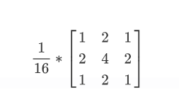
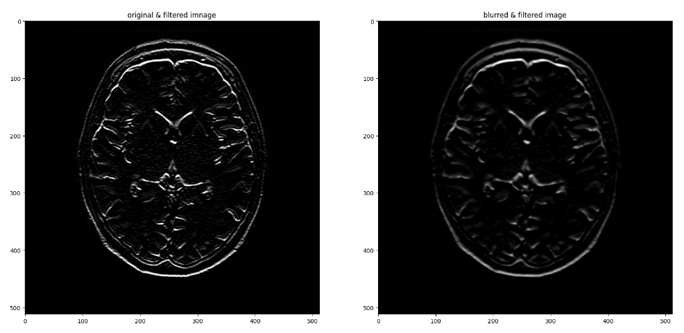
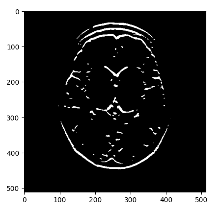
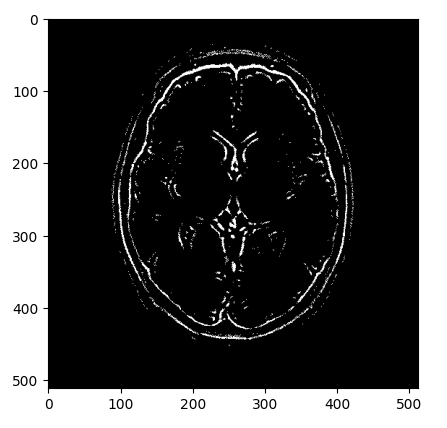

## 低通滤波: 通常使用来去噪

### 常见滤波类型

##### 均值滤波


##### 高斯滤波 (权重与距离相关)



##### 中值滤波

顾名思义取中值


### 具体代码例子

##### 高斯的模糊/去噪效果
```python
# Read in the image
image = cv2.imread('images/brain_MR.jpg')

# Convert to grayscale for filtering
gray = cv2.cvtColor(image, cv2.COLOR_BGR2GRAY)

# Create a Gaussian blurred image
gray_blur = cv2.GaussianBlur(gray, (9, 9), 0)

# use custom kernal
# gaussian = (1/16)*np.array([[1, 2, 1],
#                            [2, 4, 2],
#                            [1, 2, 1]])
# 
# gray_blur = cv2.filter2D(gray, -1, gaussian)

f, (ax1, ax2) = plt.subplots(1, 2, figsize=(20,10))
ax1.set_title('original gray'),ax1.imshow(gray, cmap='gray')
ax2.set_title('blurred image'),ax2.imshow(gray_blur, cmap='gray')
```


##### 与高通滤波配合
```python
# Filter the orginal and blurred grayscale images using filter2D
filtered = cv2.filter2D(gray, -1, sobel_y)
filtered_blurred = cv2.filter2D(gray_blur, -1, sobel_y)

f, (ax1, ax2) = plt.subplots(1, 2, figsize=(20,10))
ax1.set_title('original & filtered imnage'),ax1.imshow(filtered, cmap='gray')
ax2.set_title('blurred & filtered image'),ax2.imshow(filtered_blurred, cmap='gray')
```



```python
retval, binary_image = cv2.threshold(filtered_blurred, 50, 255, cv2.THRESH_BINARY)
plt.imshow(binary_image, cmap='gray')
```



```python
filtered_blurred = cv2.filter2D(gray_blur, -1, laplacian)
retval, binary_image = cv2.threshold(filtered_blurred, 5, 255, cv2.THRESH_BINARY)
plt.imshow(binary_image, cmap='gray')
```



