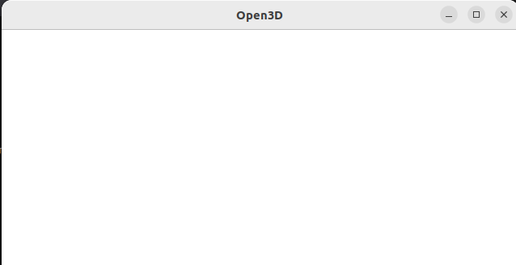
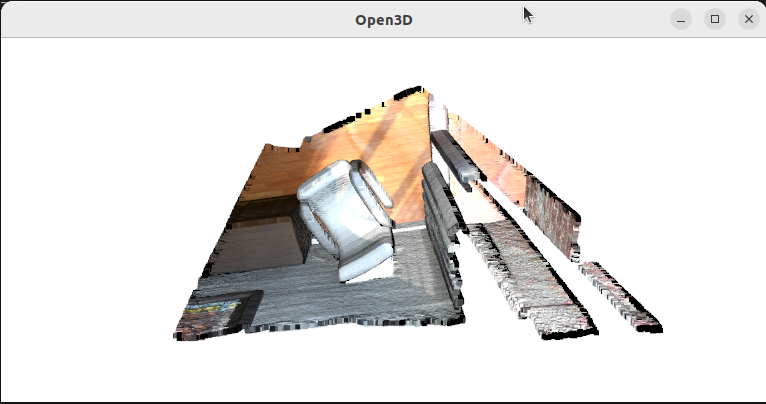

第一次使用Open3D 0.18.0，发现pcd点云显示有问题

```python
import open3d as o3d

path = "xxxxxxxxxxxxx.pcd"
pcd = o3d.io.read_point_cloud(path)
o3d.visualization.draw_geometries([pcd])
```

```log
Jupyter environment detected. Enabling Open3D WebVisualizer.  
[Open3D INFO] WebRTC GUI backend enabled.   
[Open3D INFO] WebRTCWindowSystem: HTTP handshake server disabled.
```

弹出来的窗口一片空白，也没有任何报错


<!-- more -->

#### Debug 经过

- 一开始以为是在jupyter上使用的原因，去找到了官网的文档 [Web visualizer and Jupyter](https://www.open3d.org/docs/release/tutorial/visualization/web_visualizer.html#jupyter-mode)以及对应的[example code](https://github.com/isl-org/Open3D/blob/main/docs/jupyter/visualization/jupyter_visualization.ipynb)

  ```python
  import open3d as o3d
  from open3d.web_visualizer import draw
  
  cube_red = o3d.geometry.TriangleMesh.create_box(1, 2, 4)
  cube_red.compute_vertex_normals()
  cube_red.paint_uniform_color((1.0, 0.0, 0.0))
  draw(cube_red)
  ```

  发现这个cube能显示，但是点云就怎么都不行，所以应该不是jupyter的原因。

- 多番测试无果之后，我在本机安装了Open3D，通过命令行运行，发现一样是一片空白。于是确认在本地运行和在jupyter上的结果是完全一致的。

- 查看 open3d visualization 相关的文档，找到了官方提供的点云sample，发现这个点云可以正常显示!!
  
  ```python
  sample_ply_data = o3d.data.PLYPointCloud()
  cloud = o3d.io.read_point_cloud(sample_ply_data.path)
  o3d.visualization.draw_geometries([cloud])
  ```

	```log
	[Open3D INFO] Downloading https://github.com/isl-org/open3d_downloads/releases/download/20220201-data/fragment.ply  
	[Open3D INFO] Downloaded to /home/tt/open3d_data/download/PLYPointCloud/fragment.ply
	```

  

- 于是我想办法将官方提供的点云和我本地的点云进行对比
  
  ```python
  import numpy as np
  
  # 官方点云
  cloud_colors = np.asarray(cloud.colors)
  cloud_points = np.asarray(cloud.points)
  print('cloud colors')
  print(cloud_colors)
  print('cloud points')
  print(cloud_points)
  
  # 我的点云
  pcd_colors = np.asarray(pcd.colors)
  pcd_points = np.asarray(pcd.points)
  print('\npcd colors')
  print(pcd_colors)
  print('pcd points')
  print(pcd_points)
  print('\n')
  print(pcd_colors[3453])
  print(pcd_points[3453])
  ```

	```log
	cloud colors
	[[0. 0. 0. ]
	[0. 0. 0. ]
	[0. 0. 0. ]
	…
	[0.92941176 0.89019608 0.87058824]
	[0.87843137 0.81960784 0.79215686]
	[0.87843137 0.81960784 0.79215686]]
	
	cloud points
	[[0.65234375 0.84686458 2.37890625]
	[0.65234375 0.83984375 2.38430572]
	[0.66737998 0.83984375 2.37890625]
	…
	[2.00839925 2.39453125 1.88671875]
	[2.00390625 2.39488506 1.88671875]
	[2.00390625 2.39453125 1.88793314]]
	
	pcd colors
	[[0. 0. 0.]
	 [0. 0. 0.]
	 [0. 0. 0.]
	 …
	 [0. 0. 0.]
	 [0. 0. 0.]]
	pcd points
	[[nan nan nan]
	 [nan nan nan]
	 …
	 [nan nan nan]
	 [nan nan nan]]
	
	[0.16862745 0.17254902 0.18039216]
	[0.80449188 -1.60404837 4.2510004]
	```

  这样对比，两者的格式是一致的，而且里面数据的格式也是一致的，color也是 0-1。唯一不同的是，我的点云里有 `Nan`。

- 我尝试去掉Nan:

  ```python
  # pcd = o3d.io.read_point_cloud(path)
  pcd = o3d.io.read_point_cloud(path, remove_nan_points=True)
  o3d.visualization.draw_geometries([pcd])
  ```

  就水灵灵地显示出来了！


#### 结论

也就是说，Open3D 0.18.0里 (我没有测试别的版本)，带 `Nan` 的点云是无法显示的。在读点云的时候，带上 `remove_nan_points` 就可以显示了。
