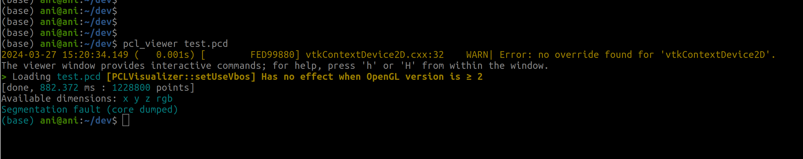
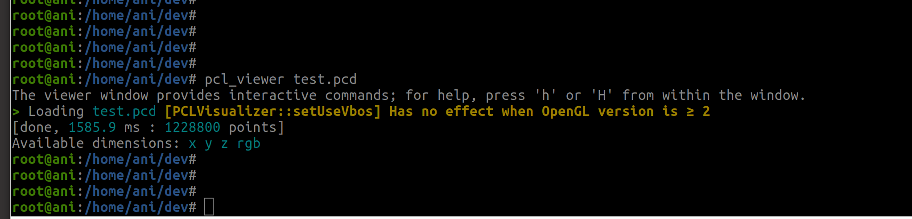

使用 `pcl-tools 1.12.1` 显示点云后出现 `segmentation fault`



使用 `libpcl-dev-1.12.1` 显示点云后显示一大串关于 `vtk` 的警告且最后出现 `sgmentation fault`

```bash
2024-03-27 07:06:36.626 (   1.903s) [        1B11AC80]vtkOpenGLPolyDataMapper:328   WARN| vtkOpenGLPolyDataMapper::SetGeometryShaderCode was deprecated for VTK 9.0 and will be removed in a future version.  Use vtkOpenGLShaderProperty::SetGeometryShaderCode instead.
2024-03-27 07:06:36.626 (   1.903s) [        1B11AC80]vtkOpenGLPolyDataMapper:321   WARN| vtkOpenGLPolyDataMapper::GetFragmentShaderCode was deprecated for VTK 9.0 and will be removed in a future version.  Use vtkOpenGLShaderProperty::GetFragmentShaderCode instead.
2024-03-27 07:06:36.626 (   1.903s) [        1B11AC80]vtkOpenGLPolyDataMapper:313   WARN| vtkOpenGLPolyDataMapper::SetFragmentShaderCode was deprecated for VTK 9.0 and will be removed in a future version.  Use vtkOpenGLShaderProperty::SetFragmentShaderCode instead.

```


similar issue: https://github.com/PointCloudLibrary/pcl/issues/5237


### 解决办法

卸载 `pcl-1.12`，使用 `1.13` 版本，但这个版本我 (`Ubuntu 22.04.4`) 无法通过 `apt` 安装，只能通过源代码编译安装。


#### 卸载 `pcl-1.12.1`

```bash
# 确认版本
apt search pcl | grep pcl

# 其中包含:
libpcl-dev/jammy,now 1.12.1+dfsg-3build1 amd64 [installed]
pcl-tools/jammy,now 1.12.1+dfsg-3build1 amd64 [installed]
```


```bash
sudo apt remove libpcl-dev pcl-tools
sudo autoremove
```


#### 在 github 上下载 `pcl` 源代码

```bash
git clone https://github.com/PointCloudLibrary/pcl.git

# checkout to 1.13.1
cd pcl
git tag
git checkout pcl-1.13.1
```


#### 按照文档编译安装 `pcl-1.13.1`

https://pcl.readthedocs.io/projects/tutorials/en/latest/compiling_pcl_posix.html

```bash
mkdir build && cd build
cmake -DCMAKE_BUILD_TYPE=Release ..
make -j2
sudo make -j2 install


# 确认安装完成
cd /usr/local/include/
ls
# 应该包含 pcl-1.13
```


#### 安装 vtk

```bash
apt install vtk9 libvtk9-dev
```


#### 测试是否可用

