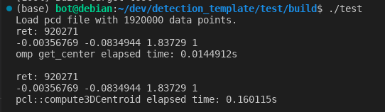
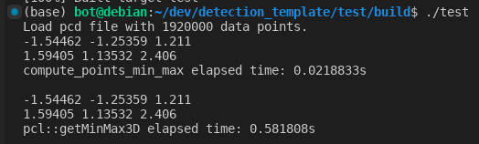

### 目录
- [1. 替换 compute3DCentroid](#1-替换-compute3dcentroid)
    - [pcl 里的源码](#pcl-里的源码)
    - [自定义接口](#自定义接口)
    - [关键点](#关键点)
- [2. 替换 getMinMax3D](#2-替换-getminmax3d)
    - [自定义接口代码](#自定义接口代码)

<!-- more -->

### 1. 替换 compute3DCentroid

```C++
Eigen::Vector4f pcaCentroid;

// 自己写的 get_center()
//----------------------------------------------------------------
auto start = std::chrono::steady_clock::now();

auto ret = get_center(*cloud, pcaCentroid);
std::cout << "ret: " << ret << std::endl;
std::cout << pcaCentroid[0] << " " << pcaCentroid[1] << " " << pcaCentroid[2] << " "
    << pcaCentroid[3] << std::endl;

auto end = std::chrono::steady_clock::now();
auto elapsed_seconds = std::chrono::duration<double>(end - start);
std::cout << "get_center elapsed time: " << elapsed_seconds.count() << "s\n\n";

// pcl::compute3DCentroid()
//----------------------------------------------------------------
start = std::chrono::steady_clock::now();

ret = pcl::compute3DCentroid(*cloud, pcaCentroid);
std::cout << "ret: " << ret << std::endl;
std::cout << pcaCentroid[0] << " " << pcaCentroid[1] << " " << pcaCentroid[2] << " "
    << pcaCentroid[3] << std::endl;

end = std::chrono::steady_clock::now();
elapsed_seconds = std::chrono::duration<double>(end - start);
std::cout << "pcl::compute3DCentroid elapsed time: " << elapsed_seconds.count() << "s\n\n";
```



可以发现我自己写的接口结果与pcl自带的接口结果是一致的，但是耗时明显更短。

##### pcl 里的源码

```c++
template <typename PointT, typename Scalar> inline unsigned int
compute3DCentroid (const pcl::PointCloud<PointT> &cloud,
                   Eigen::Matrix<Scalar, 4, 1> &centroid)
{
  if (cloud.empty ())
    return (0);

  // Initialize to 0
  centroid.setZero ();
  // For each point in the cloud
  // If the data is dense, we don't need to check for NaN
  if (cloud.is_dense)
  {
    for (const auto& point: cloud)
    {
      centroid[0] += point.x;
      centroid[1] += point.y;
      centroid[2] += point.z;
    }
    centroid /= static_cast<Scalar> (cloud.size ());
    centroid[3] = 1;

    return (static_cast<unsigned int> (cloud.size ()));
  }
  // NaN or Inf values could exist => check for them
  unsigned cp = 0;
  for (const auto& point: cloud)
  {
    // Check if the point is invalid
    if (!isFinite (point))
      continue;

    centroid[0] += point.x;
    centroid[1] += point.y;
    centroid[2] += point.z;
    ++cp;
  }
  centroid /= static_cast<Scalar> (cp);
  centroid[3] = 1;

  return (cp);
}
```

##### 自定义接口

```c++
template <typename PointT, typename Scalar>
unsigned int get_center(const pcl::PointCloud<PointT> &cloud, Eigen::Matrix<Scalar, 4, 1> &centroid)
{
  centroid.setZero();

  if (cloud.points.empty()) return 0;

  size_t sz = 0;
  float x = 0;
  float y = 0;
  float z = 0;

  for (size_t i = 0; i < cloud.points.size(); ++i)
  {
    const auto &pt = cloud.points[i];
    if (std::isnan(pt.x) || std::isnan(pt.y) || std::isnan(pt.z)) continue;
    x += pt.x;
    y += pt.y;
    z += pt.z;
    ++sz;
  }

  if (sz != 0)
  {
    centroid[0] = x / sz;
    centroid[1] = y / sz;
    centroid[2] = z / sz;
    centroid[3] = 1;
  }
  return sz;
}
```

##### 关键点

两者代码其实非常相似，只有少数几处区别。多次对比后发现问题出在累加的地方：

```c++
// -----pcl----慢-----
centroid[0] += point.x;
centroid[1] += point.y;
centroid[2] += point.z;

// ----自定义---快-----
x += pt.x;
y += pt.y;
z += pt.z;
```

只要将这几行代码替换，就可以复现pcl现成接口的耗时。猜测是因为，每次累加的时候，都需要进行矩阵的读写，导致效率低下。


### 2. 替换 getMinMax3D

```c++
PointT min_pt, max_pt;

// 自己写的 compute_points_min_max()
//----------------------------------------------------------------
start = std::chrono::steady_clock::now();

pcl_utils::compute_points_min_max(*cloud, min_pt, max_pt);
std::cout << min_pt.x << " " << min_pt.y << " " << min_pt.z << std::endl;
std::cout << max_pt.x << " " << max_pt.y << " " << max_pt.z << std::endl;

end = std::chrono::steady_clock::now();
elapsed_seconds = std::chrono::duration<double>(end - start);
std::cout << "compute_points_min_max elapsed time: " << elapsed_seconds.count() << "s\n\n";

// pcl::getMinMax3D()
//----------------------------------------------------------------
start = std::chrono::steady_clock::now();

pcl::getMinMax3D(*cloud, min_pt, max_pt);
std::cout << min_pt.x << " " << min_pt.y << " " << min_pt.z << std::endl;
std::cout << max_pt.x << " " << max_pt.y << " " << max_pt.z << std::endl;

end = std::chrono::steady_clock::now();
elapsed_seconds = std::chrono::duration<double>(end - start);
std::cout << "pcl::getMinMax3D elapsed time: " << elapsed_seconds.count() << "s\n\n";
```



结果与pcl自带的接口结果是一致的，但是耗时更短。

##### 自定义接口代码

```c++
template <typename T, typename Container>
inline bool compute_points_min_max(const Container& pts_in, T& min_pt_out,
                                   T& max_pt_out) {
  if (pts_in.size() == 0) return false;

  size_t first_ind = 0;
  while (!pcl::isFinite(pts_in[first_ind])) first_ind++;

  if (first_ind >= pts_in.size()) return false;

  min_pt_out = max_pt_out = pts_in[first_ind];

  for (size_t i = 0; i < pts_in.size(); ++i) {
    const auto& pt = pts_in[i];
    if (!pcl::isFinite(pt)) continue;

    if (pt.x > max_pt_out.x)
      max_pt_out.x = pt.x;
    else if (pt.x < min_pt_out.x)
      min_pt_out.x = pt.x;

    if (pt.y > max_pt_out.y)
      max_pt_out.y = pt.y;
    else if (pt.y < min_pt_out.y)
      min_pt_out.y = pt.y;

    if (pt.z > max_pt_out.z)
      max_pt_out.z = pt.z;
    else if (pt.z < min_pt_out.z)
      min_pt_out.z = pt.z;
  }

  return true;
}

template <typename PointT>
inline bool compute_points_min_max(const pcl::PointCloud<PointT>& cloud,
                                   PointT& min_pt_out, PointT& max_pt_out) {
  return compute_points_min_max(cloud.points, min_pt_out, max_pt_out);
}
```
