# 无人驾驶第一课：从 Apollo 起步

[udacity课程链接](https://www.udacity.com/course/self-driving-car-fundamentals-featuring-apollo--ud0419)

## 概览

### 硬件

- 线控驾驶车辆：可通过电子控制的基础车辆，而不仅仅用过实体方向盘、油门踏板、刹车踏板来控制。
- 控制器区域网络 (CAN) : 车辆的内部通信网络。计算机系统通过CAN卡连接汽车内部网络，发送加速、制动和转向信号。
- 全球定位系统 (GPS) : 通过绕地卫星接收信号，帮助我们确定所处位置信息。
- 惯性测量装置 (IMU, Inertial Measurement Unit) : 通过跟踪位置、速度、加速度和其他因素，测量车辆的运动和位置。
- 激光雷达 (LiDAR) : 由一组脉冲激光器组成，可360度扫描车辆周围，这些激光束的反射形成了可用于了解环境的点云。可用于检测障碍物和检测其他车辆的速度，分辨率低，但成本低且不受天气和照明条件影响。
- 摄像头捕获图像数据，可使用计算机视觉来了解周围环境，例如检测交通灯。

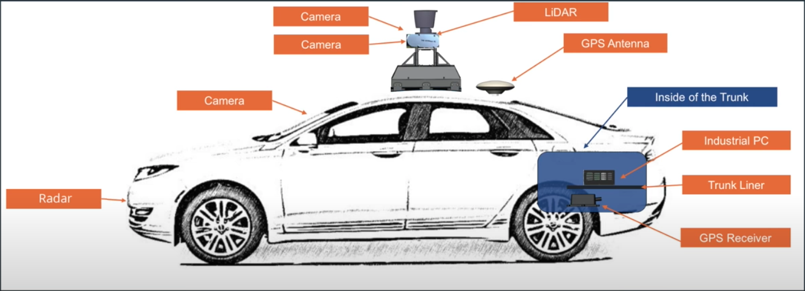

### 开源软件栈

- 实时操作系统 (RTOS) : 可确保在给定时间内完成特定任务，Ubuntu + Apollo
- 运行时框架 : ROS的定制版，改进了共享内存的功能和性能、去中心化和数据兼容性 (protobuf)
- 应用程序模块 : 包括MAP引擎、定位、感知、规划、控制、端到端驾驶以及人机接口 (HMI) 

### 云服务

- Apollo 云服务包含高精度地图、仿真环境、数据平台、信息安全、空中软件升级 (OTA)、智能语音系统 (DuerOS) 等

## 高精度地图 HD Map

- 高精度地图包含大量的驾驶辅助信息。最重要的信息是道路网的精确三维表征，例如交叉路口布局和路标位置。还包含很多语义信息，比如交通管制信息 (交通灯、道路限速等)，和城市的三维模型 (道路、建筑物、隧道等)
- 能到达**厘米级**的精度

- 高精地图用于定位（寻找地标）：

  从各类传感器收集的数据查找地标，与地图上的已知地标进行比较。这一过程需要经过预处理 (消除不准确或质量差的数据)、坐标变换 (将来自不同视角的数据转换为统一的坐标系)、数据融合 (将来自各种车辆和传感器的数据合并)。

- 高精地图用于感知：
  - 传感器受到距离和环境的限制
  - 传感器的视野容易被障碍物遮挡，高精地图可以补充信息
  - 可以帮助传感器缩小检测范围 (ROI)，提高检测精度和速度
- 高精地图用于规划：
  - 可帮助车辆找到合适的行车空间
  - 帮助规划器确定不同的路线选择，以便选择最佳方案
  - 帮助预测器预测道路上其他车辆在将来的位置
  - 预知道路限速和障碍物等，使车辆提前减速或变道

- 使用OpenDRIVE格式

- 高精度地图的构建由5个过程组成：数据采集、数据处理、对象检测、手动验证、地图发布

  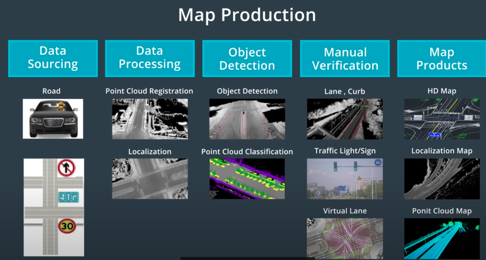

## 定位 Localization

### 简介

- 车辆将其传感器识别的地标与高精度地图上存在的地标进行比对
- 在这过程中，需要在它自身坐标系和地图坐标系之间转换数据
- 目标：在地图上以10cm的精度确定车辆的精确位置
- 常见的定位方法：GNSS RTK、惯性导航、LiDAR定位、视觉定位

###  GNSS RTK

- GNSS : 全球导航卫星系统
- GPS是使用最广泛的GNSS系统
- GPS共3个部分
  - 卫星：配备了高精确度的原子钟。在任何特定时间，大约有30颗GPS卫星在外层空间运行
  - 世界各地的控制站：用于监视和控制卫星，使系统保持运行且验证GPS广播信号的精确度
  - GPS接收器：存在于手机等设备中，正常情况下每次应该至少检测到4颗GPS卫星。 通过测量信号的飞行时间来计算距离卫星的距离。3颗卫星可以定位，再加1颗可以确定海拔。
- 实时运动定位 (RTK) : 在地面上建立几个基站，每个基站都知道自己精确的 ”地面实况“ 位置，每个基站也通过GPS来测量自己的位置，两者之间的偏差则为GPS测量结果中的误差。将这个误差发送到GPS接收器，以供其调整自身的位置计算。

- 使用 RTK 可以使 GPS **精度达到10cm**，但高障碍物或天气等仍然可能阻挡GPS信号。
- **GPS更新频率为10Hz**，也就是每0.1s更新一次。在0.1s的间隔内，速度为60km/h的车大概会行驶1.67m，差不多是一个车位的距离，这个更新频率对于自动驾驶来说太低了。

### 惯性导航

- 使用加速度、初始速度和初始位置来计算汽车在任何时间点的车速和位置

- 惯性测量单元 (IMU) 是测量物体三轴姿态角以及加速度的装置

- IMU的主要组件

  - 三轴加速度计：精确测量加速度
  - 三轴陀螺仪：三个外部平衡环一直在旋转，但spin axis始终固定在世界坐标系中，通过测量旋转轴和三个外部平衡环的相对位置，可以计算出车辆在坐标系中的位置

- IMU的优点是**更新频率高**，可达1kHz，可提供接近实时的位置信息。缺点是误差会随时间的推进而增加，**只能用于很短时间范围内的定位**。

- 可以与GPS配合一起使用，称为组合惯导。一方面，IMU弥补了GPS更新频率较低的缺陷；另一方面，GPS纠正了IMU的运动误差。但山间/城市峡谷/地下隧道中行驶，有可能长时间获取不到GPS的更新，也会导致整个定位面临失败风险。

### LiDAR定位

- 利用**激光雷达**，我们可以通过**点云匹配**来对汽车进行定位。该方法将来自激光雷达传感器的检测数据与预先存在的高精度地图连续匹配，从而获知汽车在高精地图上的全球位置和行驶方向。
- 点云定位方法
  - 迭代最近点 (ICP) : 对于一个点云中的每个点，我们需要找到另一点云中最接近的匹配点，最终收集到许多匹配点对，然后计算出这些点对的平均距离误差，通过点云的平移和旋转来最大限度地降低这一平均距离误差，从而完成传感器扫描和地图之间的匹配。最后将通过传感器扫描到的车辆位置转换为全球地图上的位置，并计算出在地图上的精确位置。
  - 滤波算法：消除冗余信息，并在地图上找到最可能的车辆位置。
  - Apollo使用了直方图滤波算法，也叫做误差平方和算法 (SSD)。将通过传感器扫描的点云滑过地图上的每个位置，在每个点上计算扫描的点与高精度地图上的对应点之间的误差或距离，对其平方求和。平方和越小，则扫描结果与地图之间的匹配越准确。
  - 卡尔曼滤波：用于根据我们在过去的状态和新的传感器测量结果来预测当前的状态。具体来说是使用了预测更新周期，首先根据之前的状态以及对移动距离和方向的估计，来估计或预测新的位置，然后使用传感器测量新的位置并加以纠正，利用概率规则将不完美的传感器测量结果和现有的位置预测结合起来，永远遵循这个预测更新周期。
- LiDAR定位的优点在于**稳健性**，缺点在于**难以构建高精地图并使其保持更新** (包含很多瞬态元素)。

### 视觉定位

- 通过观察结果、概率和地图来确定车辆最可能的位置
- 因为使用粒子或点来估计最可能的位置，所以称为**粒子滤波**。
- 比如对车道线进行拍摄，然后将道路摄像头图像与地图进行比较，通过匹配度来计算车辆在不同位置的概率，以连续的概率计算来确定车辆在道路中的位置。
- 视觉定位的优点在于图像数据很容易获得，而**缺点在于缺乏三维信息和对三维地图的依赖**。

### Apollo定位

- Apollo使用基于GPS、IMU和激光雷达的**多传感器融合定位系统**。
- GNSS定位输出位置和速度信息，LiDAR定位输出位置和行进方向信息，融合框架通过卡尔曼滤波将这些输出结合在一起。卡尔曼滤波建立在两步预测测量周期之上，惯性导航解决方案用于卡尔曼滤波的预测步骤，GNSS和LiDAR定位用于卡尔曼滤波的测量结果更新步骤。

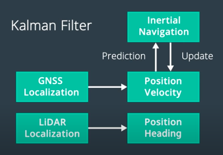

## 感知 Perception

### 计算机视觉

- 无人驾驶车有4个感知世界的核心任务

  - 检测：找出物体在环境中的位置
  - 分类：明确对象是什么
  - 追踪：随时间的推移观察移动物体
  - 分割：将图像中的每个像素与语义类别进行匹配

- 计算机视觉pipeline例子

  - 输入图像
  - 预处理 (对图像进行标准化 / 旋转 / 色彩空间转换等预处理，帮助模型更快地学习和处理图像)
  - 特征提取
  - 分类模型

  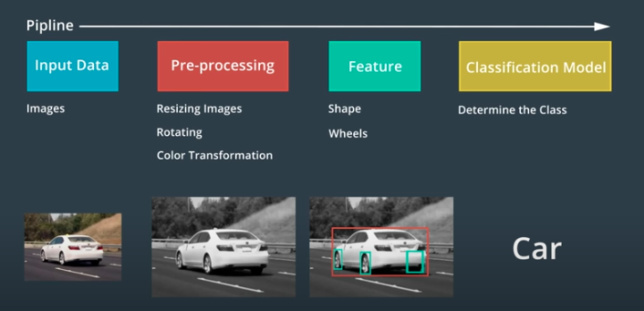

### 图像

- 对于计算机而言，图片只是一个二维网格 / 矩阵，矩阵中的每个单元格都包含一个值。
- 数字图像由像素组成，其中包含非常小的颜色或强度单位，图像中的每个像素都是一个数值，这些值构成了整个图像矩阵。
- 图像处理实际上就是在对这些值进行处理，大多数的颜色和形状转换都是通过对图像进行数学运算以及逐一像素进行更改来完成的。

### LiDAR图像 (点云)

- 激光雷达传感器可以创建环境的点云表征。
- 激光雷达发射**激光脉冲**，通过测量该激光反射回传感器的时间，来计算环境中反射该光线的物体的距离。
- 它收集的数据形成**点云**，点云中的每个点代表反射回传感器的激光束。
- 点云能表现物体的形状和表面纹理。
- 通过对点云进行聚类和分析，可以获得足够的信息对对象进行检测、跟踪或分类。

### 机器学习

- 机器学习是使用特殊算法来训练计算机从数据中学习的计算机科学领域。一般来说，学习结果会存放在一种被称为 “模型” 的数据结构中。
- 模型是一种可用于理解和预测世界的数据结构。
- 监督学习 : 使用数据和相关的真值标记来训练模型
- 非监督学习 : 不提供真值标记，而是通过分析输入的数据，计算机凭借自行学习找到区别
- 半监督学习 : 使用少量的标记数据和大量的未标记数据来训练模型
- 强化学习 : 允许模型通过尝试许多不同的方法来解决问题，然后衡量哪种方法最为成功

### 神经网络

- 人工神经网络由大量的人工神经元组成。人工神经元负责传递和处理信息，这些神经元也可以被训练。
- 神经网络会对图像提取多种特征 (可能是人类无法描述或无法理解的特征)，计算机将调整这些特征的权重，以完成最终任务。

- 训练由三步循环组成
  - 前馈 : 首先随机分配初始权重 (也就是每个神经元的值)，然后给神经网络提供图像，使其产生输出值
  - 误差测定 : 计算真值标记与前馈过程所产生的输出值之间的偏差
  - 反向传播 : 通过神经网络反向发送误差，每个人工神经元都对其值进行微调，从而生成更准确的网络

### 卷积神经网络

- 卷积神经网络 (CNN) 接受多维输入，包括二维和三维的大多数传感器数据。

- 相对于标准神经网络，CNN可以维持输入像素之间的空间关系。

- CNN 通过将滤波连续划过图像来收集信息，每次收集信息时，只对整个图像的一小部分区域进行分析，这被称为 “卷积”。

  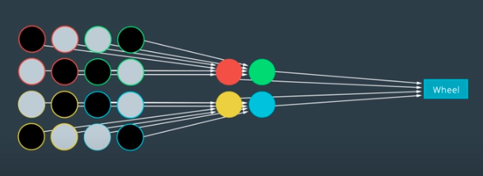

- 当我们用滤波对整个输入图像进行 “卷积” 时，我们将该信息与下一个卷积层相关联。例如，第一个卷积层可能会识别出图像中的基本边缘和颜色信息；然后在第一层的基础上连接一个新的滤波，使用图像的边缘和颜色信息来检测更复杂的结构，比如轮子/车窗等；而另一个卷积可以使用这些轮子/车门来识别整个车辆；最终CNN可以使用这一高阶信息对车辆进行分类。

  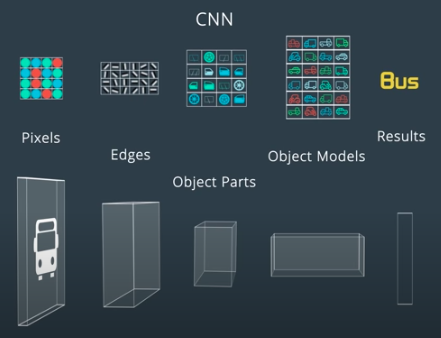

### 检测和分类

- 障碍物

  - 静态障碍物：墙壁、树木、杆子、建筑物等
  - 动态障碍物：行人、车辆等

- 计算机需要知道障碍物的位置，然后对其进行分类。

- 可以使用单一CNN体系结构对对象进行检测和分类，通过在单个网络体系结构的末端附加几个不同的“头”，可以执行不同的任务。

  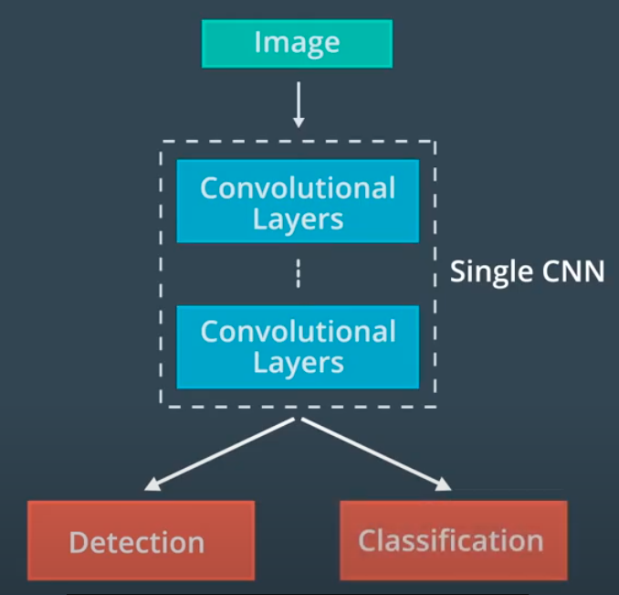

- 一种经典的体系结构为RCNN，以及其变体 Fast RCNN 和 Faster RCNN。
- YOLO 和 SSD 是具有类似形式的不同体系结构。

### 追踪

- 追踪的好处
  - 解决遮挡问题（预测之前检测到但在当前帧中被遮挡的物体的位置）
  - 保留物体的身份信息
- 追踪的第一步为**确认身份**：通过查找特征相似度最高的对象，可以将在前帧中检测到的所有对象与在当前帧中检测到的对象进行匹配；物体的位置和速度信息也有助于快速匹配对象。
- 确认身份后，使用对象的位置结合**预测算法**，可以预估在下一个时间段中物体的速度和位置，这个预测结果又可以帮助识别下一帧中的相应对象。

### 分割

- 语义分割实际上是对图像的每个像素进行分类。

- 分割可帮助我们尽可能详细地了解环境和确定车辆可驾驶区域。

- 图像分割依赖于一种特殊类型的CNN——全卷积网络 (FCN)。

- FCN 使用卷积层来替代传统CNN体系结构末端的连接层，则整个网络中的每一层都为卷积层。

- FCN 可在原始输入图像之上提供逐像素的输出（通过对中间输出进行上采样的方式，使输出尺寸与原始输入图像的尺寸相等）。

  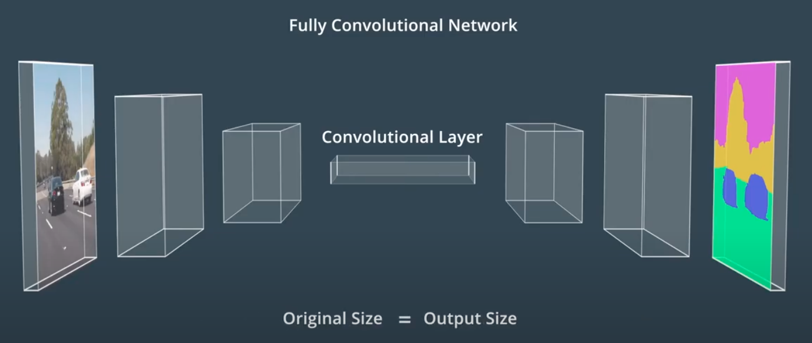

- 网络的前半部分对输入图像的特征进行了提取和编码，通常称为编码器；后半部分对提取到的特征进行解码，并将其应用于输出，通常称为解码器。

### Apollo 感知

- Apollo感知模块可以检测障碍物、交通信号灯和车道。
- 对于**三维物体检测**，Apollo在高精度地图上使用ROI来重点关注相关对象，将ROI应用于图像和点云数据，以缩小搜索范围并加快感知。然后将过滤后的数据输入到检测网络，产生用于构建围绕对象的三维边界框输出。最后使用 Detection to Track Association 算法来跨时间识别单个对象。
- Detection to Track Association : 先保留在每个时间步要追踪的对象列表，然后在下一个时间步中找到每个对象的最佳匹配。
- 对于**交通灯分类**，Apollo先使用高精地图来确定前方是否存在交通信号灯；如果前方存在交通灯，高精地图会返回灯的位置，这可以缩小摄像头的搜索范围；在摄像头捕获到交通信号灯的图像后，Apollo使用检测网络对图像中的灯进行定位；将裁剪后的交通灯图像提供给分类网络，以确定交通灯的颜色。
- 对于**车道线和动态物体的检测**，Apollo使用YOLO网络完成。在经过YOLO网络检测后，在线检测模块会并入来自其他传感器的数据，对车道线预测或是动态物体的检测结果进行调整，最终传递到规划和控制模块。

### 传感器

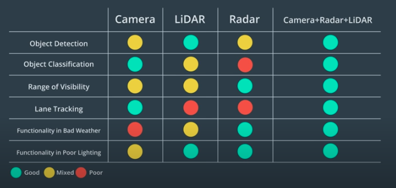

- **摄像头**的优势在于图像分类，主要用于交通信号灯分类和车道检测。
- **激光雷达** (激光探测与测量) 的优势在于障碍物检测，且不受环境光影响，可在夜间使用，分辨率较高。缺点是不能直接测量对象的速度，必须使用两次或多次扫描之间的位置差来确定；受天气和传感器清洁程度影响很大，需要保持清洁；块头比其他传感器更大，难以安装，目前一般安装在车顶。
- **雷达** (无线电探测与测量) 的优势在于探测范围和应对恶劣天气。雷达通过多普勒效应来直接测量速度，可以把速度作为独立的测量参数，从而提升了融合算法的收敛速度。因为雷达波在坚硬表面会回弹，它可以直接测量对象距离，无需在视线范围内也可以，可以发现可能会被阻挡的建筑物和对象。缺点在于分辨率较低 (尤其是在垂直方向)，对金属敏感，来自静态物体的反射可能产生问题。
- Apollo使用激光雷达和雷达来检测障碍物，用于融合输出的主要算法为卡尔曼滤波。
  - 第一步为预测
  - 第二步为更新测量结果
    - 同步更新：同时更新来自不同传感器的测量结果
    - 异步更新：逐个更新所收到的传感器测量结果

## 预测 Predition

### 简介

预测模块对感知模块检测到的障碍物进行行为研究和预测。预测模块接收障碍物的数据和基本的感知信息 (包括位置、朝向、速度、加速度) ，根据这些信息生成障碍物的预测轨迹。

- 预测需要
  - 实时性
  - 准确性
  - 具备学习能力：车辆越多情况会越复杂，不可能开发出每种场景的静态模型；需要使用多源的数据对其进行训练，使算法能随着时间的推移而提升预测能力。
- 两种预测方法
  - **基于模型预测**：为障碍物生成不同行为的模型，通过观察障碍物的行为来更新不同模型的概率，从而预测障碍物的行为路径。优点在于直观，且结合了物理知识、交通法规、人类行为等多方面的知识，比如可以结合物理知识 (摩擦力等) 来准确地确定车辆何时会在潮湿的路面上滑行。
  - **数据驱动预测**：使用机器学习算法，通过观察结果来训练模型；一旦模型训练好，就可以在现实世界中使用此模型去做出预测。优点在于，使用的数据越多，预测效果就会越好

- 除了障碍物的位置、朝向、速度、加速度外，预测模块还会考虑车道段内障碍物的位置 (比如从物体到车道线段边界的纵向和横向距离)，以及之前时间间隔里障碍物的状态信息，以提高预测的准确度。

### 车道序列

- 用车道序列描述障碍物行为：将道路分成多个部分，每个部分都覆盖了一个易于描述车辆运动的区域，将车辆的行为划分为一组有限的模式组合，并将这些模式组合描述成车道序列。

- 使用车道序列框架的目标是为道路上的物体生成轨迹。

- 预测车道线段之间的过渡：假设在车道段0中检测到一辆车，我们会预测在接下来的几个时间段中它将如何行驶。很明显有两个选择：0 -> 4 -> 5 或者 0 -> 1 -> 3 -> 7。通过这样的分析，可以将预测问题简化为选择问题，那么只需要选择车辆最有可能采取的车道顺序 (通过计算每个车道序列的概率)。

  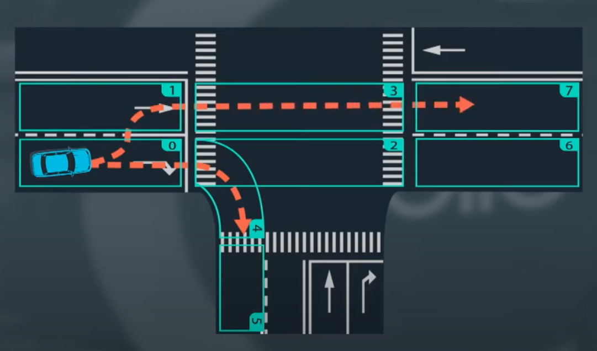

- 计算概率：我们需要一个模型，将车辆状态和车道段作为输入，而输出车辆可能采用每个车道序列的概率。
- 使用观测数据对模型进行经验性训练：将真实的车辆行为提供给模型，不仅包括车道段和对象的状态，还包括对象最终选择哪条车道序列。每个记录将由观察对象跟随的车道段序列和对象的相关状态组成；在每个时间点，对象占用一个车道段并具有特定的状态；整个记录由一系列车道段和对象的相关状态组成。

### 递归神经网络（RNN）

- RNN 是一种利用时间序列数据特征的预测方法
- 神经网络是可训练的多层模型，从输入提取高级特征，并利用这些特征来计算得到输出。
- 神经网络有很多种结构。一个基本的神经网络首先得到输入，然后将数据通过隐藏层，经过处理，最后得到输出。这种结构也被称作**多层感知网络** (MLP)。

- 每一个输入数据由原始的数据和对应的标签组成。

- 神经网络通过**反向传播 (back propagation)** 学习数据。首先，神经网络得到输入并产生输出，然后比较输出和真值 (ground truth) 之间的误差，误差通过反向传回整个网络，中间的隐藏层根据观察到的误差调整权重，以提高神经网络的准确率。

  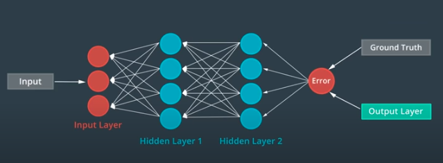

- 我们可以建立这样的多重结构的递归神经网络，称为**MLP单元**，从数据序列中提取出高级特征。每个MLP单元将序列的一个元素作为输入，并预测序列的下一个元素作为输出；为了对元素之间的顺序关系建立模型，在每个单元之间建立一个额外的连接；于是**每个单元根据原始输入和前一个单元的输出进行预测**。这就是RNN的基本结构。

  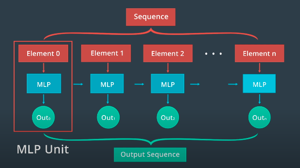

### Apollo RNN预测

- Apollo 使用RNN建立一个模型来预测车辆的目标车道：为车道序列提供一个RNN模型，为相关对象状态提供另一个RNN模型，连接这两个RNN模型的输出并将它们输出到另一个神经网络，来估计每个车道序列的概率，具有最高概率的车道序列就是目标车辆的预测车道序列。

- 训练数据：每条记录都包含一个车道序列、相关的对象状态和一个标签，标签指示了对象是否遵循此特定车道序列。

- 通过网络输出和标签真值的误差，使用反向传播来训练网络。

  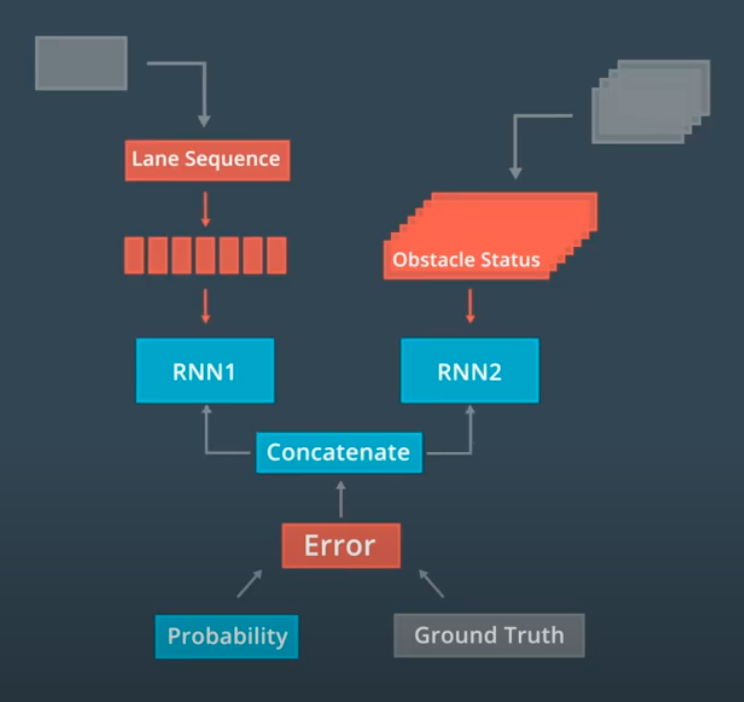

### 生成轨迹

- 生成轨迹是预测的最后一步。

- 一旦我们预测到物体的车道序列，我们就可以预测物体的轨迹。

- 在任意两点A和B之间，物体的行进轨迹有无限的可能。我们可以先通过设置约束条件，来去除大部分候选轨迹。

  - 假设车辆将与目标车道的中心对齐
  - 去除车辆无法实际执行的轨迹
  - 考虑车辆当前的速度和加速度

  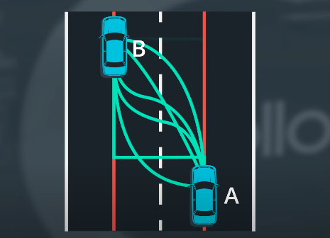

  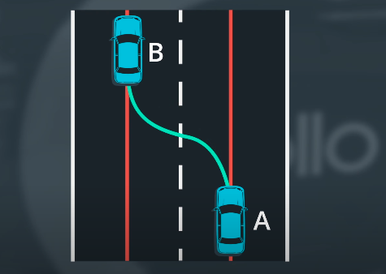

- 实际上并不会列出所有可能的轨迹再逐一去除它们，而是在数学理论上来应用这一想法。首先获得车辆在两点的位置和方向，这两点的姿态代表着运动模型的起始状态和最终状态，使用这两个条件来拟合一个**多项式模型**。大多数情况下，这种多项式足以进行轨迹预测。

## 规划 Planning [未完成]

## 控制 Control [未完成]

### PID 控制

- PID控制：
  - P：比例控制
  - D：微分，致力于使运动处于稳定状态
  - I：积分
- 优点：简单，只需要知道车辆与目标轨迹有多大的偏离
- 缺点：是一种线性算法，需要应用不同的PID控制器来控制转向和加速，很难将横向和纵向控制结合起来；依赖于实时误差测量，受到测量延迟限制时可能会失效。

### 线性二次调节器

- 线性二次调节器 (LQR) : 是基于模型的控制权，通过使用车辆的状态来使误差最小化，可用于横向控制。
- 横向控制包含4个组件
  - 横向误差
  - 横向误差的变化率
  - 朝向误差
  - 朝向误差的变化率
- 车辆的3个控制输入 : 转向、加速、制动
- 状态空间方程 : 

$$
\dot{x} = Ax + Bu
$$

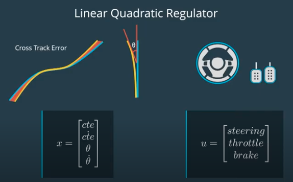

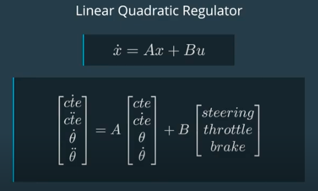

### 模型预测控制

- 模型预测控制 (MPC) 是一种更复杂的控制器，非常依赖于数学优化

- 基本上可以归结为3个步骤：

  - 建立车辆模型
  - 使用优化引擎计算有限时间范围内的控制输入
  - 执行第一组控制输入

- 只执行第一组控制输入，可以在每个时间步里不断地重新评估控制输入的最有序列，使实际产生的车辆状态与模型更接近。

- 第一步中建立的车辆模型近似于汽车的物理特性，它可以估计将一组控制输入应用到车辆时具体会发生什么。

- 优化引擎的工作原理是通过搜索密集数学空间来寻求最佳解决方案，车辆模型的约束条件 (比如车辆能实际实现的转向范围等) 可以缩小搜索范围。

  